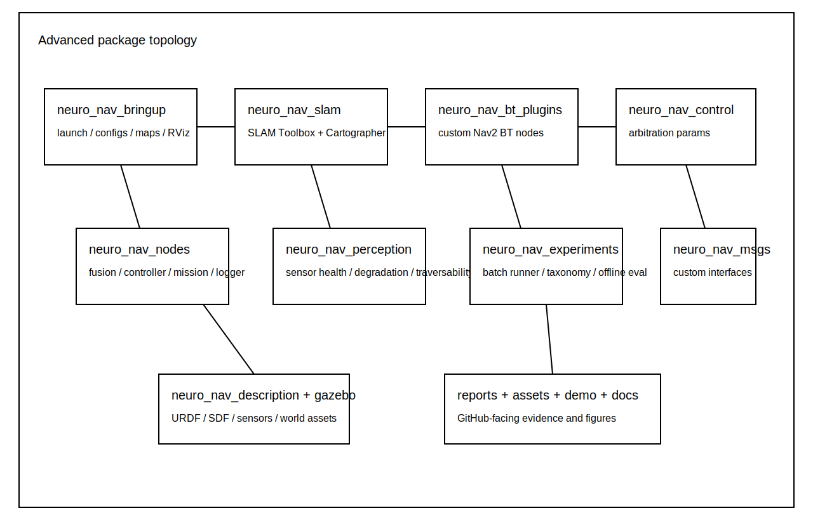

# Neuro-Embedded Navigation Lab

A **simulation-first mobile autonomy research platform** built around the **Neuro-Embedded Robotics System** direction in the uploaded elite blueprint, which defines Project 2 as an architecture centered on **SNN + RL hybrid control**, **ROS 2**, and **simulation/video deployment**. This repository packages that direction as a multi-package ROS 2 research workspace with Nav2, SLAM backends, ros2_control, sensor degradation experiments, and bag-grounded evaluation.


## What this package now contains

### Core runtime stack
- ROS 2 Jazzy + Gazebo workspace
- `ros2_control` differential-drive actuation
- Nav2 integration with behavior-tree execution
- hybrid neuro-controller path via `/cmd_vel_neuro`
- richer sensor suite: LiDAR, IMU, RGB, depth, bumper
- live-capture and runtime-demo scaffolding

### New advanced packages
- `neuro_nav_msgs` — custom mission / health / failure interfaces
- `neuro_nav_bt_plugins` — custom BT nodes for hybrid arbitration
- `neuro_nav_slam` — SLAM Toolbox + Cartographer launch wrappers
- `neuro_nav_perception` — health monitoring + degradation injection + traversability proxy
- `neuro_nav_experiments` — mission metrics, failure taxonomy, bag-first evaluation
- `neuro_nav_control` — controller arbitration parameters



## Why this version is materially stronger

This version stops being a polished demo repo and starts looking like a **lab platform**:
- mission-level navigation instead of single-goal only
- optional online SLAM instead of static-map-only assumptions
- behavior-tree controller arbitration instead of flat command logic
- sensor degradation experiments instead of nominal-only sensing
- explicit failure taxonomy instead of informal “failed run” wording
- rosbag-grounded evaluation workflow instead of one-off summary numbers

## Quickstart targets

### Classical map-based mode
```bash
cd ros2_ws
source /opt/ros/jazzy/setup.bash
colcon build --symlink-install
source install/setup.bash
ros2 launch neuro_nav_bringup sim.launch.py
```

### Mission stack with perception + experiments
```bash
ros2 launch neuro_nav_bringup mission_stack.launch.py degradation_profile:=nominal
```

### Online SLAM mode
```bash
ros2 launch neuro_nav_slam slam_online.launch.py
```

### Localization mode on saved map
```bash
ros2 launch neuro_nav_slam localization.launch.py
```

### Batch report generation
```bash
python3 scripts/run_mission_batch.py --output-dir reports/mission_batches --repeats 5
python3 scripts/evaluate_ros_run.py --bag demo/sample_live_capture --output reports/ros_runs/summary.json
```

## Visual evidence boards

### Mission benchmark and failure analysis


### Scenario gallery


### Runtime evidence board


### SLAM comparison board


### Sensor degradation board


## Package map

```text
ros2_ws/src/
  neuro_nav_bringup/
  neuro_nav_control/
  neuro_nav_description/
  neuro_nav_gazebo/
  neuro_nav_bt_plugins/
  neuro_nav_experiments/
  neuro_nav_msgs/
  neuro_nav_nodes/
  neuro_nav_perception/
  neuro_nav_slam/
```

## Mission autonomy concept

The system is meant to operate as a three-tier autonomy stack:

1. **Mission layer**
   - waypoint patrol / inspection
   - NavigateThroughPoses
   - timeout and abort handling

2. **Navigation layer**
   - Nav2 planner/controller/recoveries
   - BT-based controller switching
   - remap requests and recovery handling

3. **Reflex / neuro layer**
   - local hazard response
   - dynamic clutter biasing
   - near-collision emergency takeover

## Experiment protocol

This repo now supports a paper-grade experiment structure:

- scenario families:
  - open arena
  - bottleneck
  - corridor maze
  - dynamic crossing
  - blocked-goal recovery
  - sensor dropout
- methods:
  - Nav2 only
  - hybrid switching
  - hybrid + SLAM
  - hybrid + SLAM + degraded sensing
- outputs:
  - bag
  - telemetry CSV
  - mission summary JSON
  - failure taxonomy CSV
  - README-ready figure boards

See:
- `docs/slam_and_mission_protocol.md`
- `docs/full_stack_repository_spec.md`
- `reports/evidence/index.html`

## Current repository honesty standard

This package is **structurally complete** and **research-oriented**, but final runtime validation still requires a ROS 2 + Gazebo workstation. The new SLAM wrappers, BT plugin package, interfaces package, perception package, and experiment package are included so the repository reflects a serious autonomy program even before the final live workstation capture.

## Existing simulator research layer

The original simulation-first benchmark layer is still present under `src/neuro_nav_lab/` and remains useful for:
- controller prototyping
- quick ablations
- offline visual report generation
- non-ROS smoke tests

## Included reports and docs
- `reports/dashboard.html`
- `reports/live_capture/index.html`
- `reports/evidence/index.html`
- `docs/full_stack_repository_spec.md`
- `docs/slam_and_mission_protocol.md`
- `docs/live_capture_edition.md`

## Final positioning

This repository should now be described as:

> **A ROS 2 Jazzy mobile autonomy research platform with Nav2, SLAM Toolbox, optional Cartographer, ros2_control, hybrid neuro-controller arbitration, sensor degradation experiments, and bag-grounded mission evaluation.**