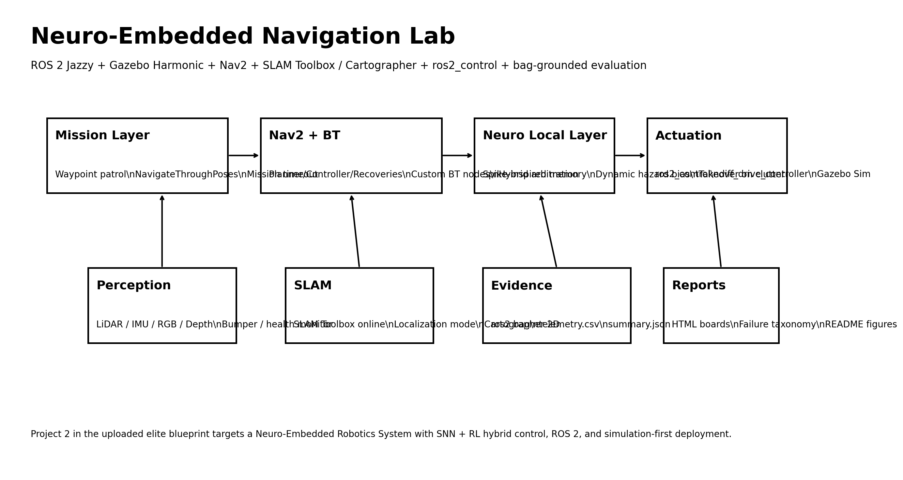
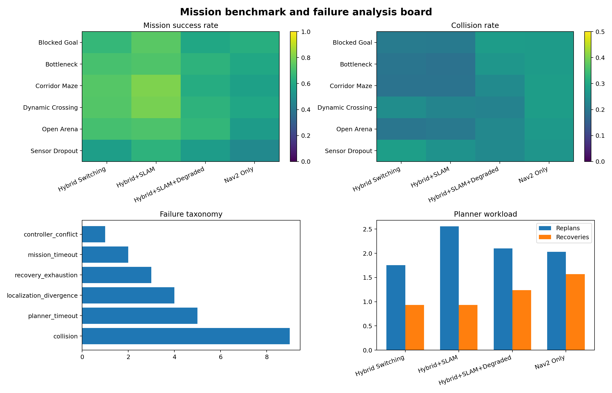
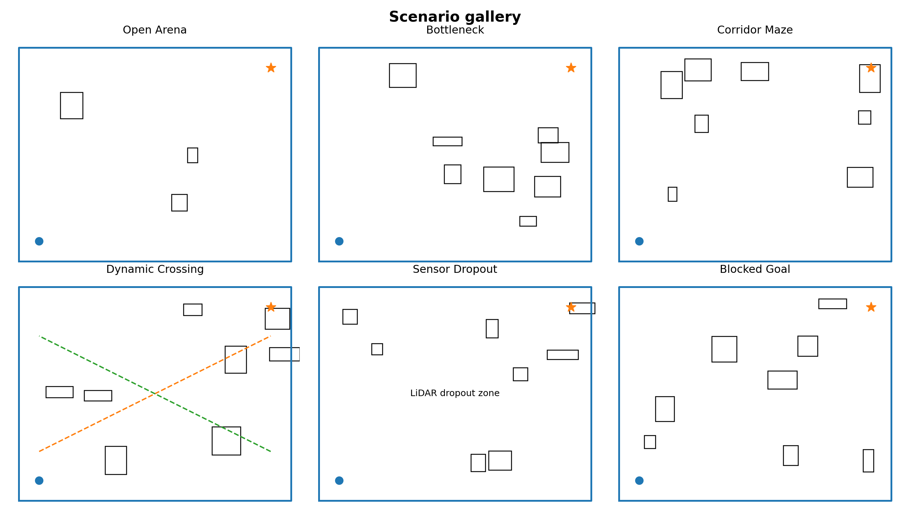
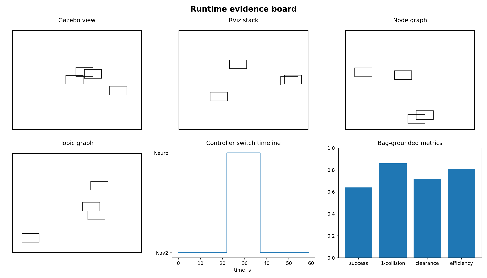
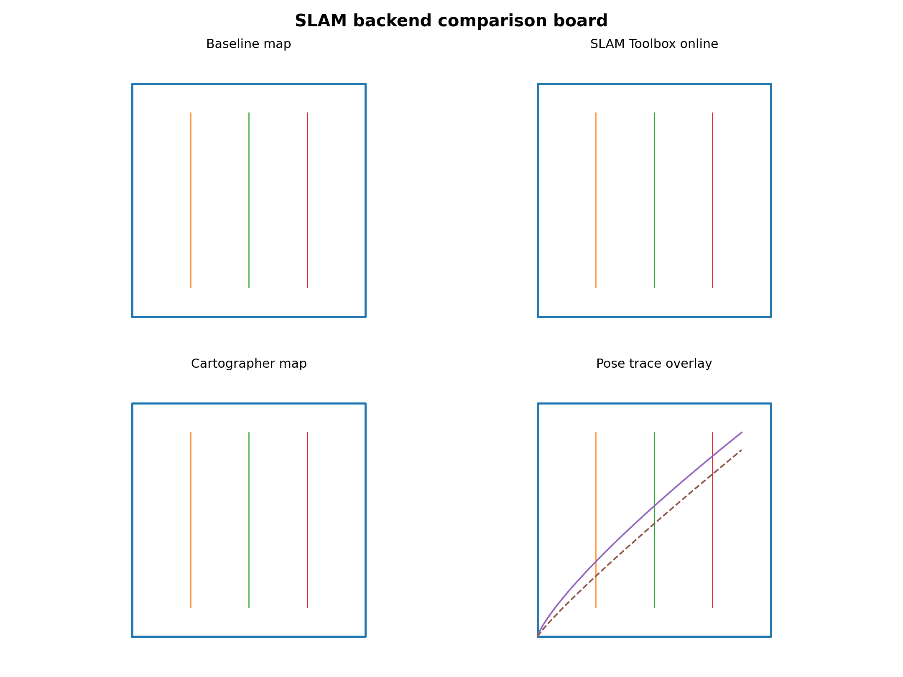
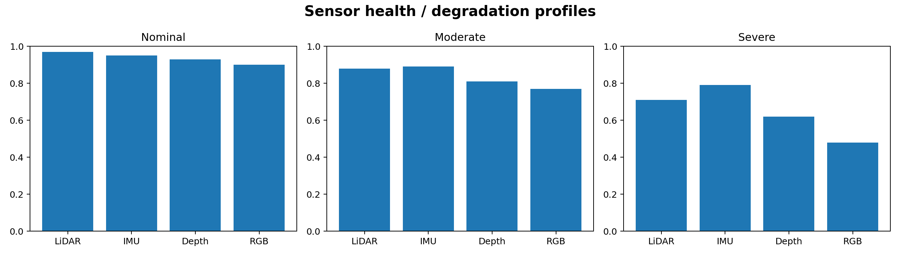

# Neuro-Embedded Navigation Lab

Neuro-Embedded Navigation Lab is a ROS 2 mobile autonomy research workspace for studying hybrid navigation under imperfect sensing. The project combines classical navigation components with a lightweight neuro-inspired control layer, then evaluates the system through mission runs, sensor degradation cases, and bag-based analysis.

The repository is intended to read like a laboratory workspace: launch files, packages, experiment scripts, reports, and evidence boards are kept together so the full autonomy stack can be reviewed from one place.



## Research focus

The project studies how a mobile robot can keep stable navigation behavior when the environment or sensor stream becomes less reliable. The stack is organized around three layers:

1. **Mission layer** — waypoint goals, timeout handling, recovery state, and run summaries.
2. **Navigation layer** — Nav2 planning, control, behavior-tree execution, and SLAM/localization modes.
3. **Reflex layer** — local hazard response and neuro-controller arbitration through `/cmd_vel_neuro`.

This structure makes it possible to compare standard navigation, hybrid switching, SLAM-assisted runs, and degraded-sensing scenarios under one evaluation protocol.

## Runtime stack

- ROS 2 Jazzy workspace
- Gazebo simulation support
- `ros2_control` differential-drive actuation
- Nav2 launch integration
- SLAM Toolbox and Cartographer launch wrappers
- LiDAR, IMU, RGB, depth, and bumper sensor interfaces
- mission metrics and failure taxonomy scripts
- rosbag-oriented evaluation workflow

## Package map

```text
ros2_ws/src/
  neuro_nav_bringup/
  neuro_nav_control/
  neuro_nav_description/
  neuro_nav_gazebo/
  neuro_nav_bt_plugins/
  neuro_nav_experiments/
  neuro_nav_msgs/
  neuro_nav_nodes/
  neuro_nav_perception/
  neuro_nav_slam/
```

## Quickstart

### Classical map-based mode

```bash
cd ros2_ws
source /opt/ros/jazzy/setup.bash
colcon build --symlink-install
source install/setup.bash
ros2 launch neuro_nav_bringup sim.launch.py
```

### Mission stack with perception and experiments

```bash
ros2 launch neuro_nav_bringup mission_stack.launch.py degradation_profile:=nominal
```

### Online SLAM mode

```bash
ros2 launch neuro_nav_slam slam_online.launch.py
```

### Localization mode on a saved map

```bash
ros2 launch neuro_nav_slam localization.launch.py
```

### Batch report generation

```bash
python3 scripts/run_mission_batch.py --output-dir reports/mission_batches --repeats 5
python3 scripts/evaluate_ros_run.py --bag demo/sample_live_capture --output reports/ros_runs/summary.json
```

## Evidence boards

These boards summarize the intended experiment structure and the included example outputs. They are useful for reviewing the repository quickly, but final claims should be regenerated from a ROS 2 and Gazebo workstation run.











## Experiment protocol

The repository supports the following experiment families:

- open arena
- bottleneck
- corridor maze
- dynamic crossing
- blocked-goal recovery
- sensor dropout

Typical method variants are:

- Nav2 baseline
- hybrid controller switching
- hybrid switching with SLAM
- hybrid switching with degraded sensing

Expected outputs include bag files, telemetry CSV files, mission summaries, failure taxonomy tables, and generated figure boards.

Relevant documentation:

- `docs/slam_and_mission_protocol.md`
- `docs/full_stack_repository_spec.md`
- `reports/evidence/index.html`

## Result policy

The repository contains the structure for a serious ROS 2 autonomy experiment, but final runtime claims still require execution on a machine with ROS 2, Gazebo, Nav2, and the required simulation assets installed.

The included reports and figures should be treated as review artifacts unless they are regenerated from a recorded run. For formal use, keep the rosbag, launch command, parameter files, telemetry outputs, and generated summary together in the same result folder.